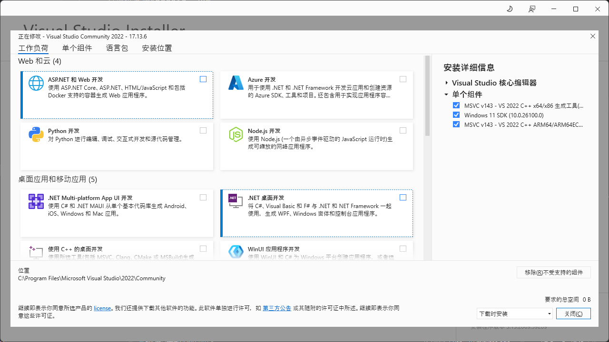

# Rust For KMP

该项目包含使用 [UniFFI](https://github.com/mozilla/uniffi-rs.git) 的 Kotlin 多平台绑定生成。

目前仅支持Android、JVM。

## 如何使用

- [Rust](https://rustup.rs/) 用于构建Rust库。
- [Android Studio](https://developer.android.google.cn/studio)
- [交叉编译提示](https://gobley.dev/docs/cross-compilation-tips)
  根据此文档中的交叉编译提示进行交叉编译配置。
- [Zig](https://ziglang.org/download/)
  参考[交叉编译提示](https://gobley.dev/docs/cross-compilation-tips#building-for-windows-on-arm)
  进行配置。

构建插件来自 [gobley](https://github.com/gobley/gobley)。

## 部分配置参考

- Visual Studio Installer 安装的组件 
- .cargo/config.toml

  ```
  [target.aarch64-unknown-linux-gnu]
  linker = "C:\\Users\\PC\\.cargo\\aarch64-unknown-linux-gnu-cc.bat"
  
  [target.x86_64-unknown-linux-gnu]
  linker = "C:\\Users\\PC\\.cargo\\x86_64-unknown-linux-gnu-cc.bat"
  
  [target.aarch64-linux-android]
  linker = "C:\\Users\\PC\\AppData\\Local\\Android\\Sdk\\ndk\\27.0.12077973\\toolchains\\llvm\\prebuilt\\windows-x86_64\\bin\\aarch64-linux-android21-clang.cmd"
  
  [target.armv7-linux-androideabi]
  linker = "C:\\Users\\PC\\AppData\\Local\\Android\\Sdk\\ndk\\27.0.12077973\\toolchains\\llvm\\prebuilt\\windows-x86_64\\bin\\armv7a-linux-androideabi21-clang.cmd"
  
  [target.x86_64-linux-android]
  linker = "C:\\Users\\PC\\AppData\\Local\\Android\\Sdk\\ndk\\27.0.12077973\\toolchains\\llvm\\prebuilt\\windows-x86_64\\bin\\x86_64-linux-android21-clang.cmd"
  
  [target.i686-linux-android]
  linker = "C:\\Users\\PC\\AppData\\Local\\Android\\Sdk\\ndk\\27.0.12077973\\toolchains\\llvm\\prebuilt\\windows-x86_64\\bin\\i686-linux-android21-clang.cmd"
  ```

.bat文件来自[此处](https://gobley.dev/docs/cross-compilation-tips/#make-cargo-use-zig-windows)

## 实现了什么

一个使用Rust进行简单计算的程序。由于返回类型的原因，结果并不准确。参考此[文档](https://www.jetbrains.com/help/kotlin-multiplatform-dev/compose-multiplatform-create-first-app.html#run-your-application)
即可在Android、Windows上运行。
